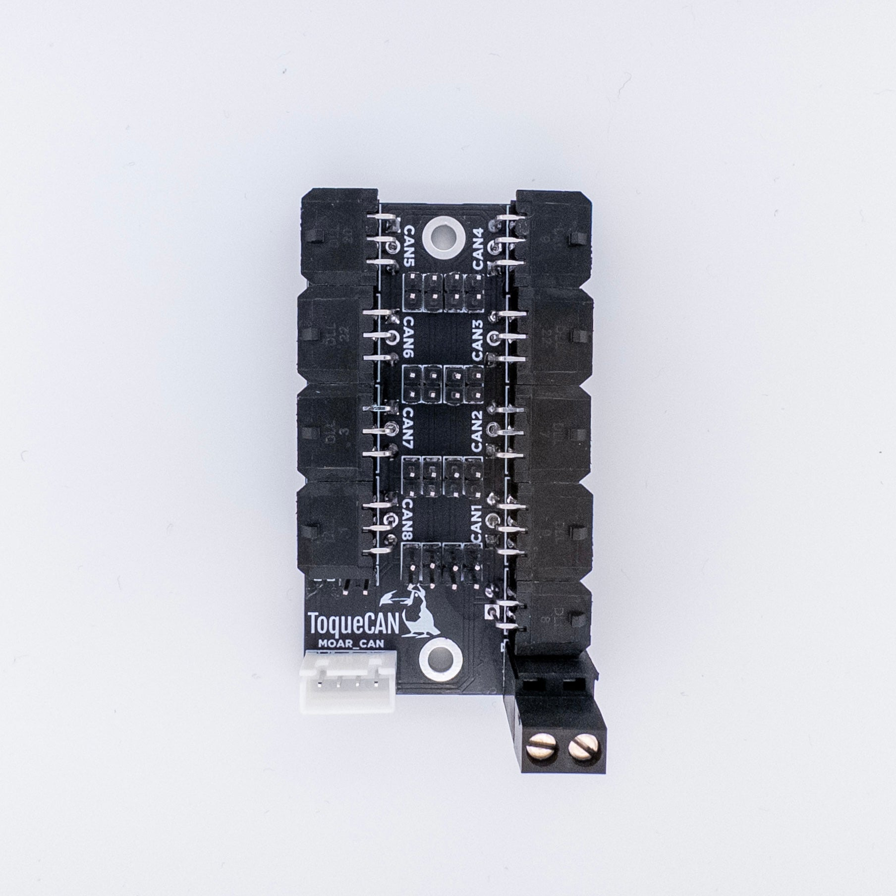

# MOAR_CAN

MOAR_CAN is a [ToqueCAN](../../../ToqueCAN)-compatible 8/9-port CAN bus hub designed for 3D printers with multiple CAN devices, like toolchanger printers with multiple toolheads. Unlike most CAN bus hub PCBs on the market, MOAR_CAN follows the specs recommended in the standard for 1Mbit CAN. A more detailed explanation of this can be found in the manual.

## Purchasing a MOAR_CAN
[Isik's Tech Official Store](https://store.isiks.tech/products/moar_can)

## Instructions

[MOAR_CAN Manual](https://docs.isiks.tech/moar-can/manual/)

## Notes
- This project does not come with any warranty, if you choose to build/use a PCB manufactured using published files in this repository, you are doing this at your own risk.
